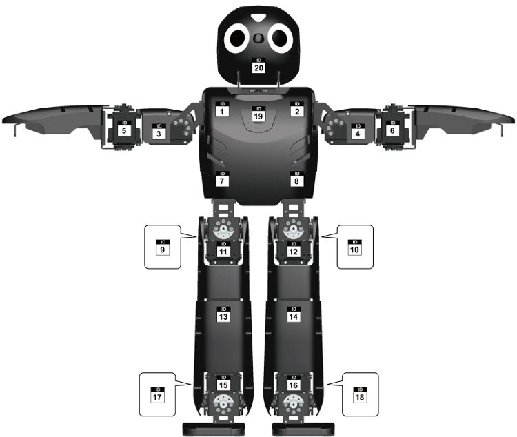

# Darwin Lofaro Legacy
The Darwin Lofaro Legacy system is made to run on an origonal ROBOTIS Darwin OP platform utilizing ros2 as a middle ware to allow for communication between the origonal computer and a second computer such as a raspi.

# CM730 Driver

Designed to talk directly with the CM730.  Updates the state and reference

# Changes
* Call motors, FTs, and the CM730 to have a return status level of 1 (default is 2)
* Change the LEFT FT sensor to have an ID of 111.
* Change the RIGHT FT sensor to have an ID of 112.

# Todo:
* Impliment walking via ROS utilizing the ROBOTIS walking gate but comunicating via ROS
* Impliment alternative serial library to cut down on the latency and overhead caused by the dyn lib
* Make a version that just publishes the IMU data and takes upper body commands and a twist message for walking

# Joint Index for the Darwin-Op

# Install
## Network Configuration 
On the Darwin's comptuer (the fitpc) we will use the 'interfaces' method to apply the wifi settings and the static ip for connecting to the backpack.

  vi install/interfaces

- Change "YOUR_SSID" to the SSID of your network.
- Change "YOUR_PASSWORD" to the password to your wifi network.

Note: The ethernet is set to static with the ethernet having a higher number metric (lower priority) than the wifi.  This allows the comptuer to get internet from the wifi.
